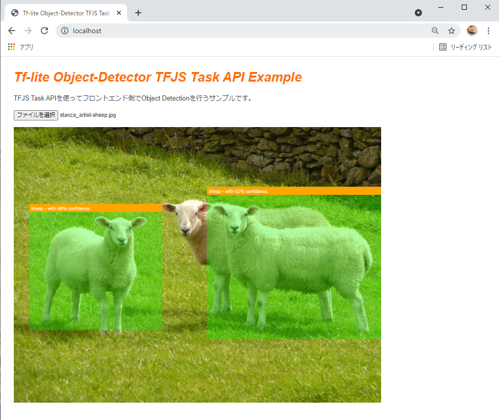
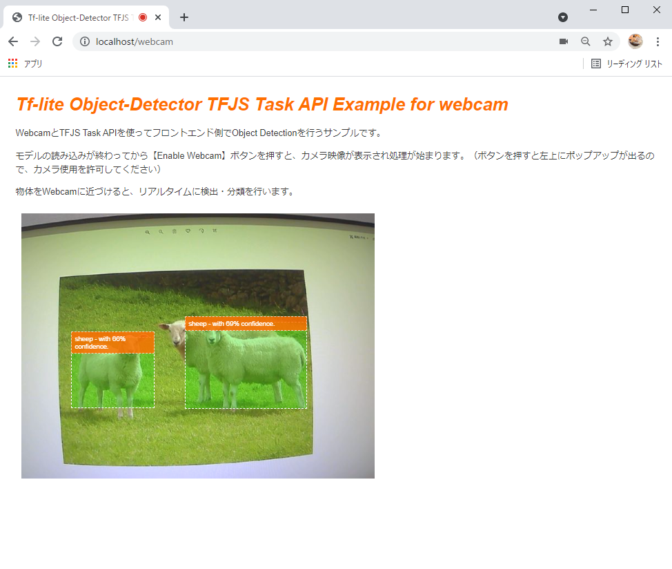
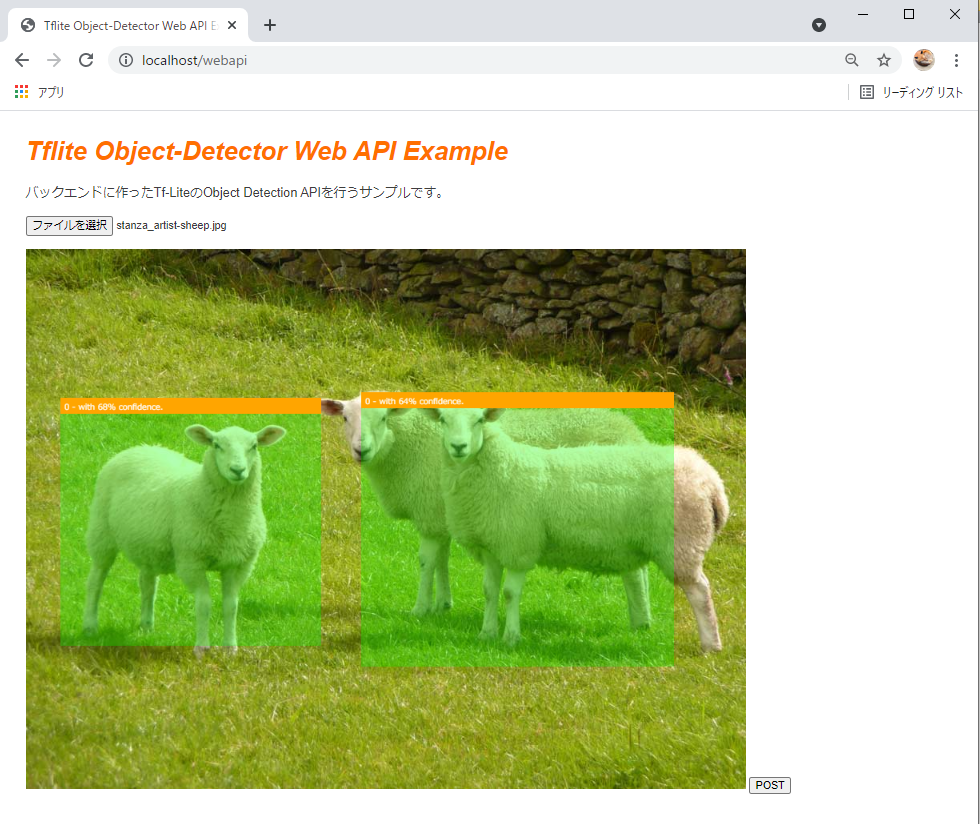
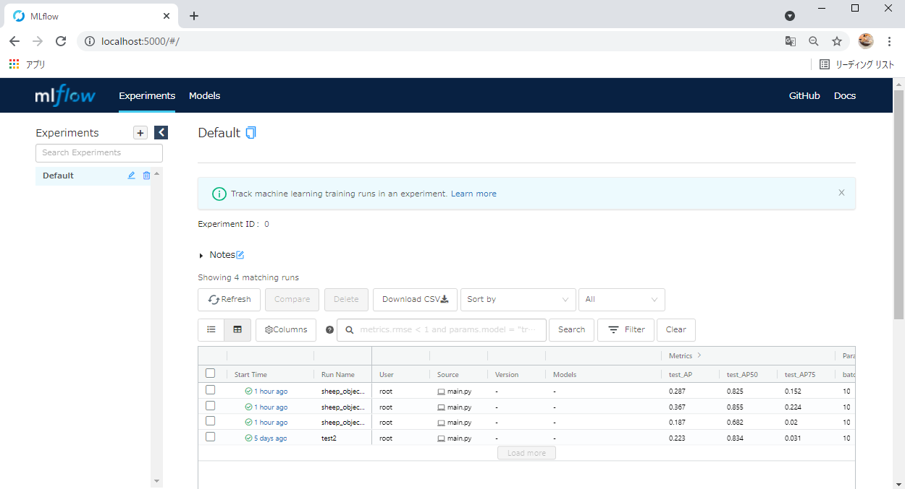

# tflite-model-maker-example
# Overview
Tensorflow Lite Model Makerで作成した物体検出モデルを、Tensorflow.js Task APIを使ってブラウザ側で推論を行う一連のデモリポジトリです。

モデル学習では、VOTTデータセットとCAP拡張を用いたデータセットからtfliteモデルを作成します。学習パイプラインではluigiを使用し、パラメータが変わったタスクのみ学習するようにしています。

ブラウザデモでは以下の3つの機能を使えるようにしています。

|||
|---|---|
|画像アップロードに対してフロントエンドで推論| |
|webcamからの画像に対してフロントエンドで推論| |
|画像アップロードに対してバックエンドで推論| |


[](https://www.youtube.com/watch?v=U8f_jOCZtfg)

# Environment

- Windows 10 home
- WSL2
- Docker

# Usage

## Model Trainer

1. データの準備
   
   学習データのディレクトリツリーは以下のようになっています。
   ```
   data/01_raw/
    ├── bg_images
    ├── cap_images
    ├── target_images
    └── vott

   ```

   - ```vott```には、VOTTでラベル付けされた画像とcsvを格納してください。
   - ```target_images```には、CAP拡張で用いるターゲット（ラベルに該当）画像を格納してください。
     - 複数ラベルの場合は以下の例のように格納してください。
        ```
        data/01_raw/
        ├── bg_images
        ├── cap_images
        ├── target_images
        │   ├── cat # ラベル名のディレクトリを作成して画像を格納すること
        │   │   ├── nc151292.png
        │   │   └── nc151474.png
        │   └── sheep
        │       ├── sheep1_1024×635.png
        │       ├── sheep2_1024×585.png
        │       ├── sheep4_1024×858.png
        │       └── sheep5_1024×994.png
        ```
   - ```bg_images```には、CAP拡張で用いる背景画像を格納してください。

2. パラメータの設定
   
   パラメータの設定は、```trainer/conf/param.ini```を編集してください。
   
   以下にパラメータのサンプルとそれぞれの説明を記載しています。

   ```ini
    [core]
    # 原則触らなくてよい
    logging_conf_file=./conf/logging.ini

    [Preprocess]
    # train,valid,testに分割する際、データをシャッフルするか否かのフラグ
    is_shuffle=False

    # is_shuffleがTrueの場合の乱数シード値
    random_shuffle_seed=100

    # CAP拡張時、1枚の背景画像から生成する拡張画像の枚数
    cap_bg_copy_num=10

    # CAP拡張時、1枚の背景画像に対してのターゲット画像の貼り付け数の制限リスト
    # [1, 4]の場合、一枚の背景画像に対して1個から4個までのターゲット画像が貼り付けられる。
    cap_object_paste_range=[1, 4]


    [Train]
    # 利用するモデル名
    # efficientdet_lite0以外を使う場合は、tflite-model-makerを要確認
    model_name=efficientdet_lite0

    # 学習時のバッチサイズ
    batch_size=10

    # 学習時のエポック数
    epochs=2

    # Trueの場合、モデル全体を学習
    train_whole_model=True


    [Report]
    # Mlflowにつける実験名
    run_name=sheep_object_detector
   ```
3. 学習の実行
   
   以下コマンドを実行する。
   ```shell
    $ cd trainer

    # イメージをビルドする.（初回のみ）
    $ docker build -f Dockerfile -t trainer .

    # 学習を実行する.
    # trainerディレクトリまでの絶対パスを自分の環境に合わせて入力すること.
    $ docker run -it -v {絶対パス}/trainer:/trainer trainer python main.py --local-scheduler Report
   ```
4. 学習結果の確認

   手順3実行後、```trainer```ディレクトリ配下にbatch.logが出力されてプログラム的な実行結果を確認できます。
   
   MLの実験結果は、以下コマンドを実行してMlflow UIを起動した後に[http://localhost:5000](http://localhost:5000)へアクセスすることで確認できます。
   ```
   $ docker run -it -v {絶対パス}/trainer:/trainer -p 5000:5000 trainer mlflow ui --host 0.0.0.0
   ```

   


## Demo
1. 学習モデルの準備
   
   MLFlow UIで確認したのち、デモで使いたいモデル（```model_fp16.tflite``` と ```model_int8.tflite```）を```demo/statics```に格納する。

2. サーバーの実行
   ```shell
   $ cd demo

   # イメージをビルドする（初回のみ）
   $ docker build -t demo .

   # デモを実行する.
   # demoディレクトリまでの絶対パスを自分の環境に合わせて入力すること.
   $ docker run --name demo_container -p 80:80 -v {絶対パス}/demo:/app demo
   ```

3. デモを試す
   
   以下のURLにアクセスしてデモを試すことができます。

   | URL | Content |
   |---|---|
   |[http://localhost:80](http://localhost:80)| 画像アップロードに対してフロントエンドで推論する。 |
   |[http://localhost:80/webcam](http://localhost:80/webcam)| webcamからの画像に対してフロントエンドで推論する。 |
   |[http://localhost:80/webapi](http://localhost:80/webapi)| 画像アップロードに対してバックエンドで推論する。 |


# Reference
- [Kazuhito00/TFLite-ModelMaker-EfficientDet-Colab-Hands-On](https://github.com/Kazuhito00/TFLite-ModelMaker-EfficientDet-Colab-Hands-On)

# Author

T-Sumida（[https://twitter.com/sumita_v09](https://twitter.com/sumita_v09)）

# Licence
tflite-model-maker-example is under MIT License.