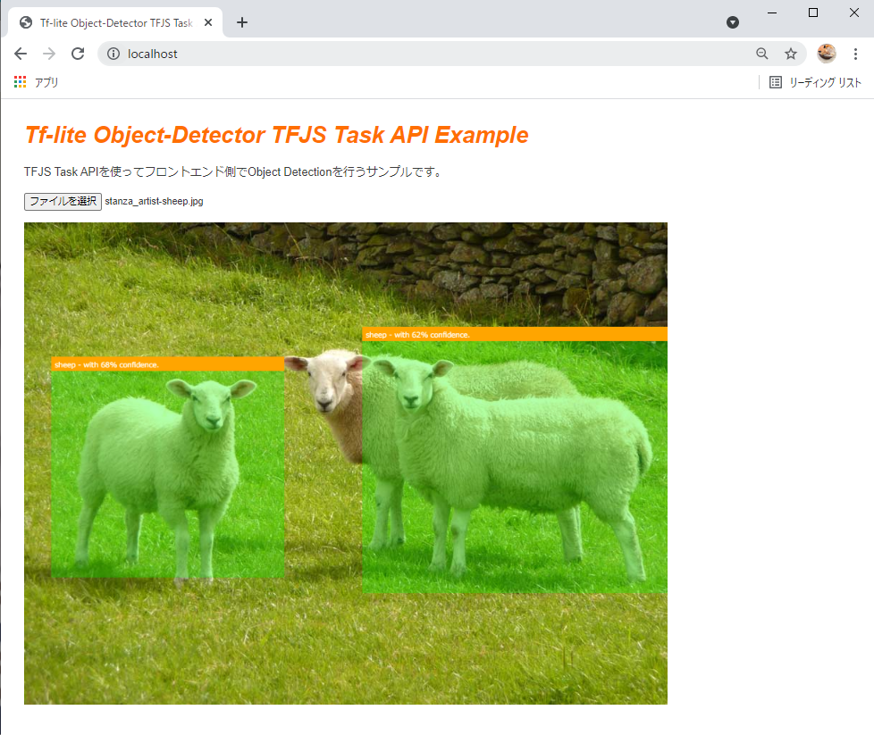
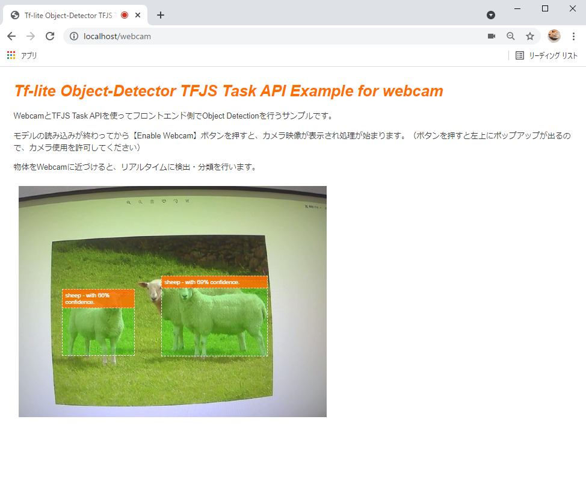
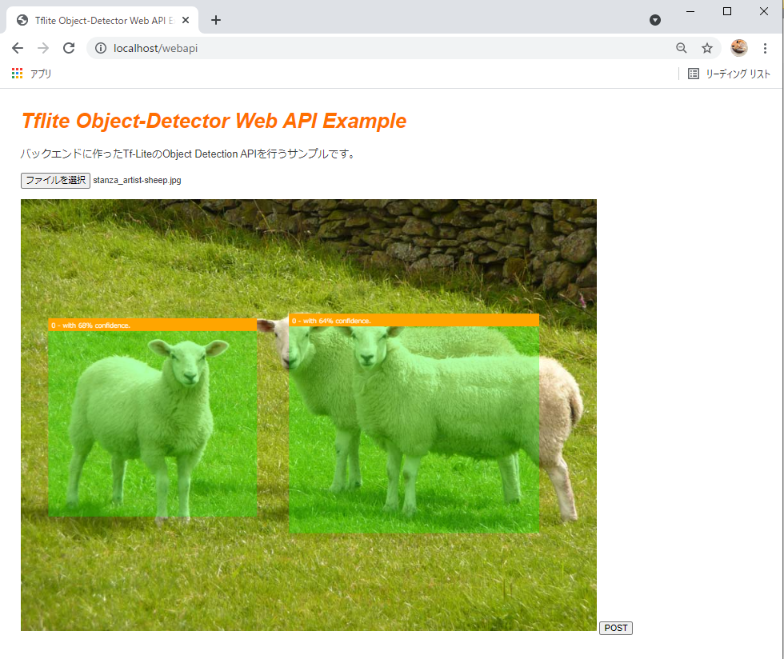
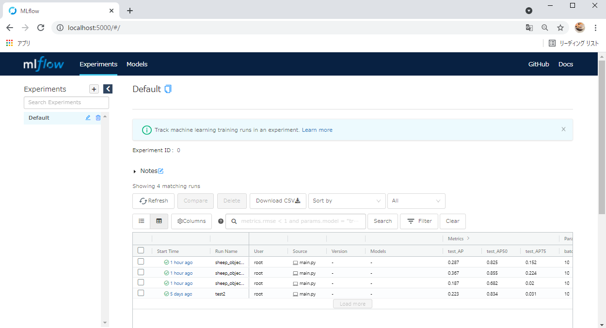

[[Japanese](./README_EN.md)/English]

# TfLiteModelMaker-TfjsTaskAPI-Example
# Overview
This is a series of demolition repositories that perform browser-side inference on object detection models created with Tensorflow Lite Model Maker using the Tensorflow.js Task API.

For model training, tflite models are created from the VOTT dataset and a dataset using the CAP extension. We use luigi in the learning pipeline to ensure that only tasks with changing parameters are trained.

In the browser demo, we have the following three features available.

|||
|---|---|
|Front-end inference for image uploads | |
|Front-end inference for images from webcam | |
|Backend inference for image uploads | |


**Demonstration video of the webcam function**

[](https://www.youtube.com/watch?v=U8f_jOCZtfg)

# Environment

- Windows 10 home
- WSL2
- Docker

# Usage

## Model Trainer

1. Data Preparation
   
   The directory tree of the training data looks like this.
   ```
   data/01_raw/
    ├── bg_images
    ├── cap_images
    ├── target_images
    └── vott

   ```

   - In ``vott``, store images and csv labeled with VOTT.
   - The ```target_images``` should contain the target images (corresponding to the labels) to be used in the CAP extension.
     - In the case of multiple labels, store them as in the following example.
        ```
        data/01_raw/
        ├── bg_images
        ├── cap_images
        ├── target_images
        │   ├── cat # Create a directory with a label name to store images.
        │   │   ├── nc151292.png
        │   │   └── nc151474.png
        │   └── sheep
        │       ├── sheep1_1024×635.png
        │       ├── sheep2_1024×585.png
        │       ├── sheep4_1024×858.png
        │       └── sheep5_1024×994.png
        ```
   - In ```bg_images```, store the background image to be used for CAP extension.

2. Setting parameters
   
   To set the parameters, edit ```trainer/conf/param.ini```.
   
   The following is a sample of the parameters and a description of each.

   ```ini
    [core]
    # In principle, you don't have to touch it.
    logging_conf_file=./conf/logging.ini

    [Preprocess]
    # Flag whether or not to shuffle the data when splitting it into train, valid, and test.
    is_shuffle=False

    # Random number seed value when is_shuffle is True
    random_shuffle_seed=100

    # When CAP is extended, the number of extended images to be generated from one background image.
    cap_bg_copy_num=10

    # List of restrictions on the number of target images that can be attached to a single background image when CAP is extended.
    # In the case of [1, 4], from one to four target images will be pasted for each background image.
    cap_object_paste_range=[1, 4]


    [Train]
    # Model name to be used
    # If you want to use something other than efficientdet_lite0, you need to check tflite-model-maker
    model_name=efficientdet_lite0

    # Batch size for learning
    batch_size=10

    # Number of epochs during learning
    epochs=2

    # If True, train the entire model
    train_whole_model=True


    [Report]
    # Experiment name to be given to Mlflow
    run_name=sheep_object_detector
   ```

3. Training
   
   Execute the following command.
   ```shell
    $ cd trainer

    $ docker build -f Dockerfile -t trainer .

    $ docker run -it -v {absolute path}/trainer:/trainer trainer python main.py --local-scheduler Report
   ```
4. Check your training results

   After the execution of step 3, batch.log will be output under the ```trainer``` directory to confirm the programmatic execution results.
   
   You can check the results of the ML experiment by running the following command to start the Mlflow UI and then accessing [http://localhost:5000](http://localhost:5000).

   ```
   $ docker run -it -v {absolute path}/trainer:/trainer -p 5000:5000 trainer mlflow ui --host 0.0.0.0
   ```

   


## Demo
1. Preparing the training model
   
   After checking with the MLFlow UI, store the models you want to use in the demo (```model_fp16.tflite``` and ```model_int8.tflite```) in ```demo/statics```.

2. Running the Server
   ```shell
   $ cd demo

   $ docker build -t demo .

   $ docker run --name demo_container -p 80:80 -v {absolute path}/demo:/app demo
   ```

3. Try the demo
   
   You can try the demo by accessing the following URL.

   | URL | Content |
   |---|---|
   |[http://localhost:80](http://localhost:80)| Front-end inference for image uploads |
   |[http://localhost:80/webcam](http://localhost:80/webcam)| Front-end inference for images from the webcam. |
   |[http://localhost:80/webapi](http://localhost:80/webapi)| Backend inference for image uploads. |


# Reference
- [Kazuhito00/TFLite-ModelMaker-EfficientDet-Colab-Hands-On](https://github.com/Kazuhito00/TFLite-ModelMaker-EfficientDet-Colab-Hands-On)

# Author

T-Sumida（[https://twitter.com/sumita_v09](https://twitter.com/sumita_v09)）

# License
tflite-model-maker-example is under MIT License.
